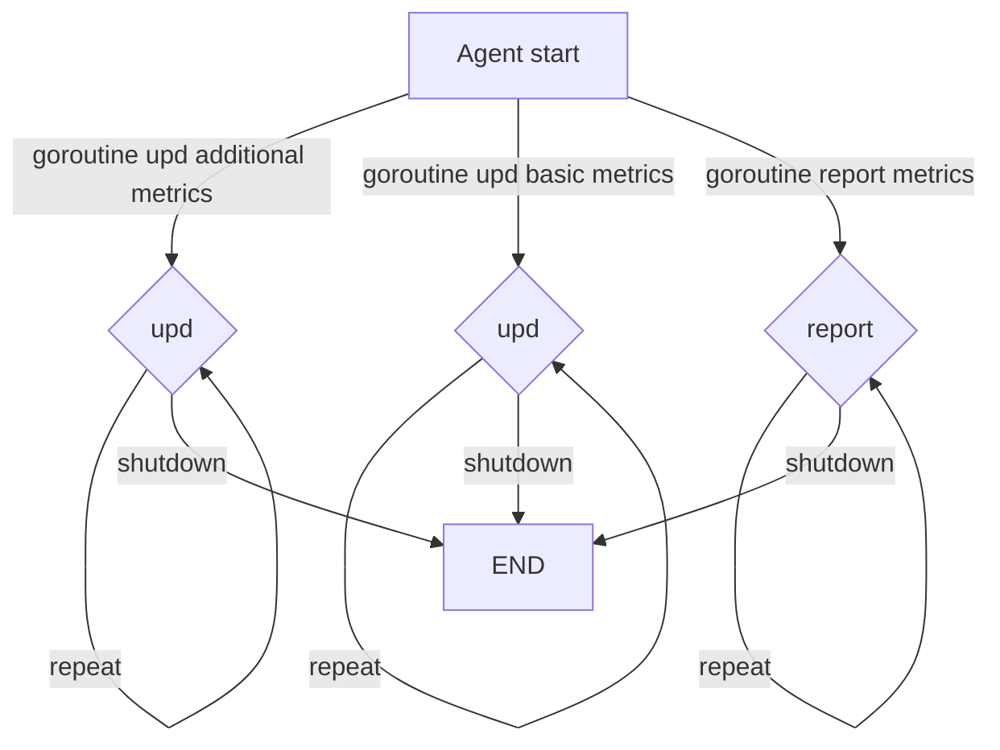
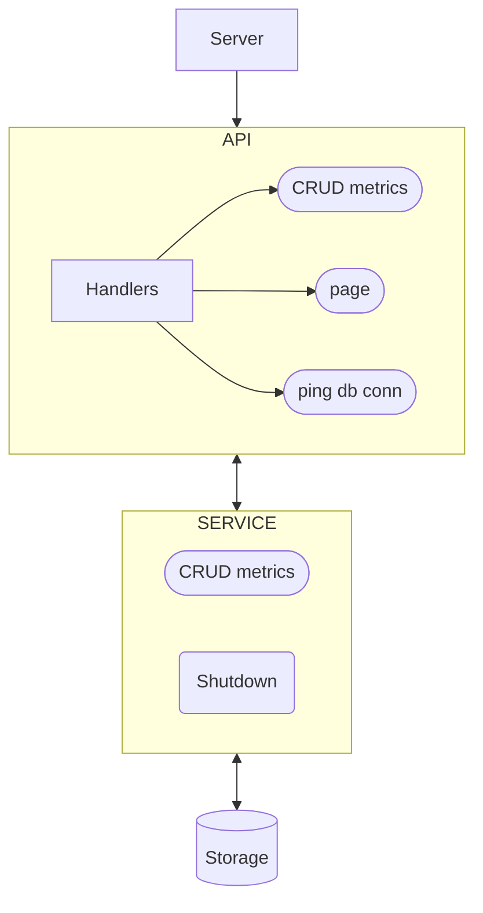

# Структура проекта
```
├── cmd
│   ├── agent                                    Точка запуска агента
│   └── server                                   Точка запуска сервера
│
├── internal
│   ├── agent
│   │   ├── config                               Конфиг агента
│   │   ├── memory                               Функциональность работы с метриками агента: создание, обновление, считывание
│   │   └── service                              Функционал агента
│   │       ├── interfaces.go                              Интерфейсы, которыми пользуется агент         
│   │       ├── mocks                                      Mock'и интерфейсов (используются для тестов)
│   │       ├── request.go                                 Реализация http-запросов
│   │       ├── request_test.go                            Юнит-тесты http-запросов
│   │       └── service.go                                 Реализация создания, запуска агента
│   └── server
│       ├── api
│       │   ├── api.go                                     Реализация API сервера
│       │   ├── compress.go                                Middleware'ы архивации/деархивации тел запросов/ответов
│       │   ├── errors.go                                  Возможные ошибки
│       │   ├── handlerMetric.go                           Обработчики чтения, обновления метрик
│       │   ├── handlerMetricPathParams.go                 Обработчики чтения, обновления метрик (тело запроса в URL)
│       │   ├── handlerMetric_test.go                      Юнит-тесты http-запросов
│       │   ├── handlerPage.go                             Обработчик открытия стартовой страницы
│       │   ├── handlerPing.go                             Обработчик-пинг хранилища данных
│       │   ├── interfaces.go                              Интерфейсы, которыми пользуется API
│       │   ├── mocks                                      Mock'и интерфейсов (используются для тестов)
│       │   ├── page.go                                    Внутренняя реализации чтения стартовой страницы
│       ├── config                               Конфиг сервера
│       ├── model                                Модели работы со списком метрик
│       ├── service                              Слой приложения
│       └── storage                              Слой хранилища
│           ├── interfaces.go                              Интерфейсы, которыми пользуется хранилище                    
│           ├── memory                                     in-memory хранилище             
│           ├── pg                                         postgres хранилище
│           └── storage.go                                 Конструктор хранилища и определение интерфейса хранилища
├── pkg
│   └── metric                                   Реализация единицы метрики
```

# Блок-схема работы агента


# Блок-схема работы сервера


# Обновление шаблона

Чтобы получать обновления автотестов и других частей шаблона, выполните следующую команду:

```
git remote add -m main template https://github.com/yandex-praktikum/go-musthave-devops-tpl.git
```

Для обновления кода автотестов выполните команду:

```
git fetch template && git checkout template/main .github
```

Затем добавьте полученные изменения в свой репозиторий.
